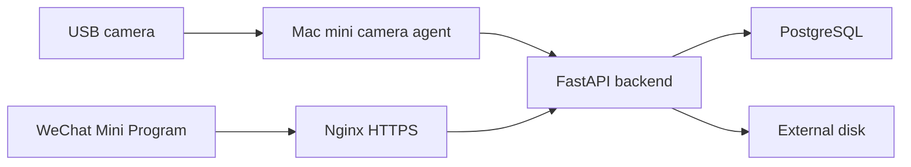

# Technical Architecture

## Components

- WeChat Mini Program: learner, teacher, and campus admin views.
- Nginx: HTTPS entrypoint on the Mac mini.
- FastAPI backend: business API and device API.
- PostgreSQL: source of truth for users, lessons, attendance, and hour ledgers.
- Camera agent: USB camera capture, face recognition, deduplication, and punch upload.
- External disk: snapshots, exports, logs, and backups.

## Deployment Shape

## Principles

- Punch events are camera facts.
- Attendance records are lesson business results.
- Hour ledgers are the only reason balances change.
- All balance changes must be transactional.
- All manual changes must create operation logs.

